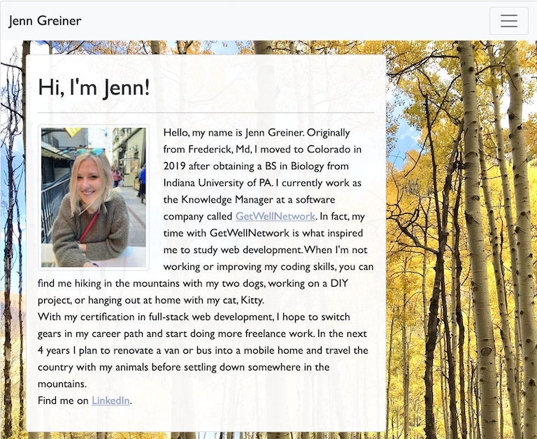
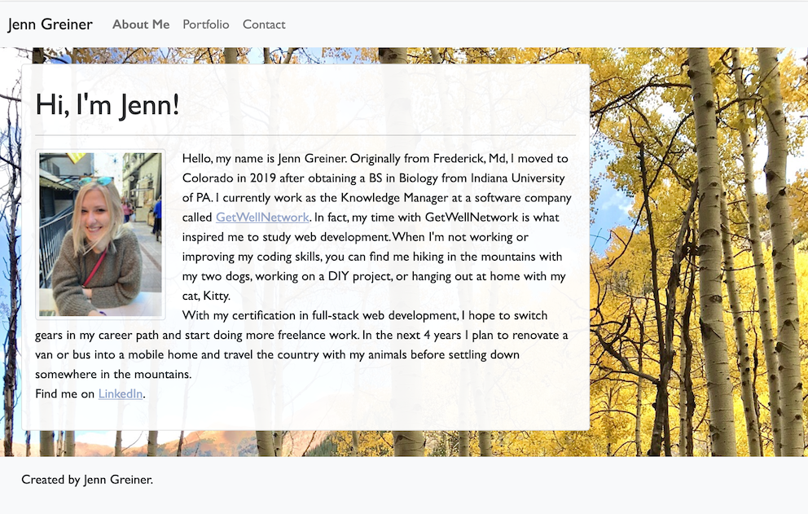

# 02 CSS and Bootstrap Homework: Responsive Portfolio

### Table of Contents:
* [User Story](#user-story)
* [Description](#description)

[Jenn Greiner Responsive Portfolio](https://jenngreiner.github.io/Css-Bootstrap-homework2/)

## User Story
As a new web developer, I need a web application that allows prospective employers and clients to view my work and contact me on a variety of device-types.

## Description 
This project is my current working portfolio. To achieve a responsive, mobile-first design that allows users to view the web application on any device, mobile or desktop, I used BootStrap CSS grid formatting. This allows the navibar, images, and page contents to visually change depending on the width of the browser window. 

## Usage
Open the [portfolio](https://jenngreiner.github.io/Css-Bootstrap-homework2/) in github. Use the developer tools to change the browser width in order to view the responsive layout changes. 

### About Me - 400px

### Portfolio - 400px

### Contact - 400px

### About Me - 768px

### Portfolio - 768px

### Contact - 768px

### About Me - 992px

### Portfolio - 992px

### Contact - 992px

## Credits
1. getbootstrap.com

## License 
- - -

